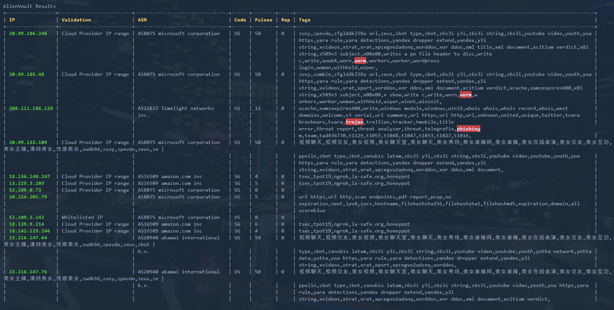
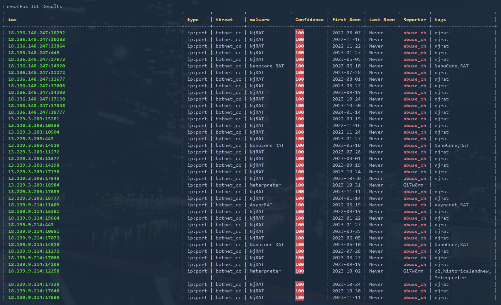
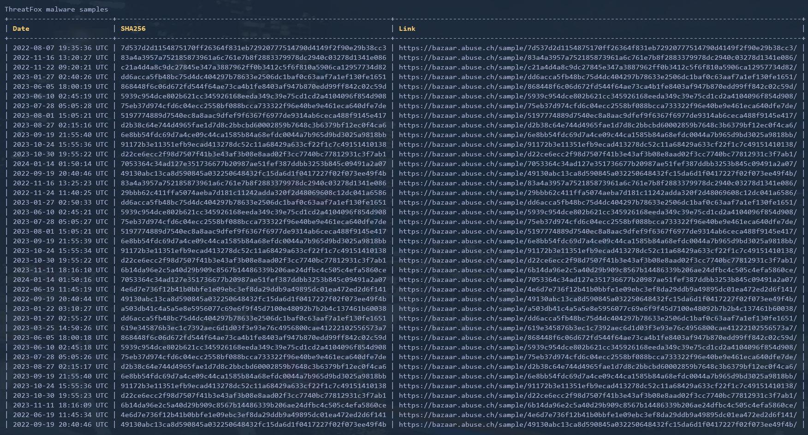

# IOC Scanner

Ioc Scanner is a simple little that tool that is designed to scan file hashes, urls and IP addresses in bulk. This is achieved by sending all data to the Virus Total backend API where the data is scanned. Once complete the API responds and the results are displayed in a concise format.









## Configuration
To configure ioc_scanner to send requests to the Virus Total API, you must create an account on [VirusTotal.com](https://www.virustotal.com/gui/sign-in) and request an API key.

Once complete you can either place your api key directly into the `config.json` (NOT RECOMMENDED) or you can store your API key in an environment variable and specify it in the config file denoted with a $.

Please note that all environment variables must begin with a $ sign in the config in order to be expanded at runtime.

Here is an example configuration below:
```json
{
    "vt_api_key": "$VT_KEY",
    "otx_api_key": "$OTX_KEY",
    "tfx_api_key": "",
    "disable_vt": false,
    "disable_otx": false,
    "disable_tfx": false,
    "supress_warnings": true
}
```

### Environment Variables

#### Windows
Environment variables on windows can be created with the following command.
```batch
setx NAME_OF_MY_ENV_VAR  94c0cedd61450d..............
```

#### Linux
Environment variables on linux can be created with the following command.
```bash
export NAME_OF_MY_ENV_VAR=94c0cedd61450d..............
```