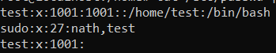
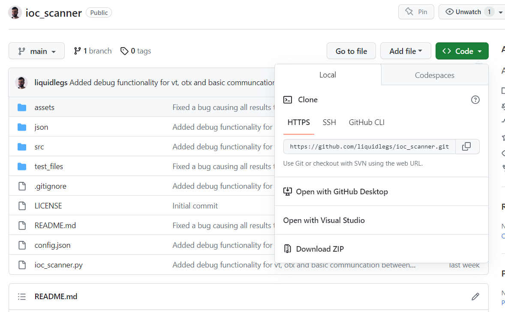
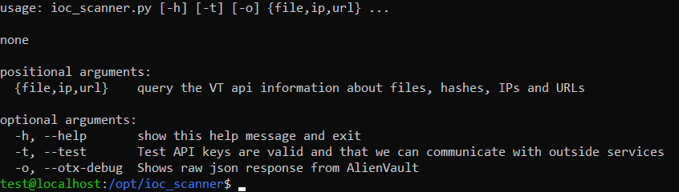

# Beginners Configuration Guide
The purpose of this document to demonstrate how to setup ioc_scanner to be used in a linux VM.

This guide will assume that the reader has never cloned a github repository and little to no knowlege about using linux operating systems. This guide will however, assume that the user knows how to create the VM on their chosen cloud platform and can SSH into it.

## Creating a new user.
When you SSH into your VM, by default there should no be no users except for the root user.
He we will create a user and add it to the sudoers group so that we are not using the system with full administrative privileges 24/7.

1. Enter the following command and replace "test" with a username of your choice `useradd -m test`
2. Set the password of the newly created user with `passwd YourUsernameHere`
3. Add the newly created to the sudoers group with `usermod YourUsernameHere -aG sudo`
4. Set the default shell for the user to bash with `usermod YourUsernameHere -s /bin/bash`
5. Verify everything has been correctly configured with the following command `cat /etc/passwd | grep YourUsernameHere; cat /etc/group | grep YourUsernameHere`

Since the user I created was "test", you should see the following results when you enter the command in step 5.

Once complete, logout of your current SSH session and log back in with the new user account and credentials you created.

## Verify git and python are installed
When log into your VM verify that git and python3 are installed. This can be done with `git --version; python3 --version`

If either of these packages are not installed, you should able to install them with `sudo apt-get install -y YourPackageName`

## Cloning Ioc_Scanner
1. Copy the repoistory link found here

2. Change to the `/opt` directory with `cd /opt`
3. Enter the command `sudo git clone https://github.com/liquidlegs/ioc_scanner.git`
4. Change the owner of the directory to the current user with `sudo chown YourUsername:YourUsername -R ioc_scanner`
5. Cd into the ioc_scanner directory
6. Install project dependencies with `pip3 install -r requirements.txt`
7. Verify that you see the following when you execute the tool with `python3 ioc_scanner.py -h`

## Obtaining Virus Total API key
In order to use this tool to perform ioc scanning in bulk, you will need to obtain a Virus Total API key. This can be done by creating a free account on Virus Total [here](https://www.virustotal.com/gui/join-us).

Once your account has been created, you can access your free API key tied your account [here](https://www.virustotal.com/gui/my-apikey).

Please keep in mind that free users are limited to 500 requests per day and are limited in what information queried from the VT backend.

## Configuring Ioc_Scanner
In order to scan iocs in bulk with ioc_scanner, every time you send a request to the backend API you will need to provide the VT API key as your authentication token.

As it would be really annoying to provide the API key for each command executed with ioc_scanner, we can provide the API to the script in a configuration file so that it can be appended to each API request.

To do this follow the steps below:
1. With a text editor of your choice open the `.bashrc` file for the current user in `/home/yourUsername/.bashrc`
2. Scroll to the bottom of the file and append the following line `export VT_KEY=your_api_key_value.............`
3. Save and close the file.
4. Optionally if you are worried about your API key being leaked, you can modify the permission of `.bashrc` so that only the current user can read the file with `chmod 600 .bashrc`
5. Modify the `config.json` in the ioc_scanner directory and add the Virus Total environment variable to the `vt_api_key` field

Please note that all environment variables specified on the config file whether on Linux or Windows must begin with a $ sign or the script will not know how to resolve the environment variable to your API key.

Once complete, logout of your current SSH session and log back in.
Verify that the environment variable is peristent with your current session using the `env | grep VT` command.

Once verified, navigate to the ioc_scanner directory and enter the following command to test the configuration `python3 ioc_scanner.py --test`